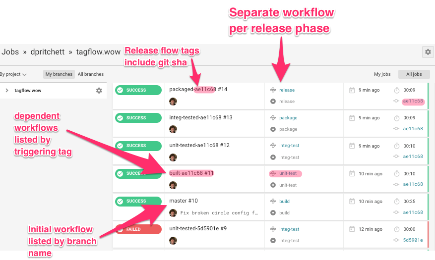
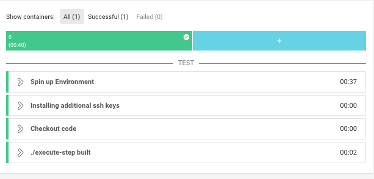

# Level up your build and release workflow using git tags to trigger CI steps
[](https://circleci.com/gh/dpritchett/tagflow.wow)

[👀 See the CircleCI logs for yourself!](https://circleci.com/gh/dpritchett/tagflow.wow)


_credit: [makeagif](https://makeagif.com/gif/fast-pinewood-derby-car-2008-scout-race-P13Xdv)_


## What is this and why would I want it?

This proof of concept shows a way to cleanly separate release processes in a semantic way that relies as little as possible on the CI tool for control flow.

**Pros**
- Smaller and simpler build steps mean more resilient CI code:
- External tooling can see exactly which commits passed which build steps without having to know how to use Circle
- Using git tags to trigger follow-up build steps keeps control flow logic outside of the CircleCI config. This means you are less tied to Circle's way of doing things.




**Cons**
- I haven't found them yet — please [open a GitHub issue here when you do](https://github.com/dpritchett/tagflow.wow/issues)!

## Tell me how it works!

### 1. User pushes a new commit `00516cb` to source control

```
~/g/tagflow.wow (master |  🚥  2) 🐠  git commit -m "Adds screenshot"
[master 00516cb] Adds screenshot
 2 files changed, 4 insertions(+)
 create mode 100644 img/annotated-circle-list.png

~/g/tagflow.wow (master |  🚥  2) 🐠  git push origin master
Enumerating objects: 7, done.
Counting objects: 100% (7/7), done.
Delta compression using up to 12 threads
Compressing objects: 100% (5/5), done.
Writing objects: 100% (5/5), 113.72 KiB | 2.53 MiB/s, done.
Total 5 (delta 2), reused 0 (delta 0)
remote: Resolving deltas: 100% (2/2), completed with 2 local objects.
To github.com:dpritchett/tagflow.wow.git
   ae11c68..00516cb  master -> master
```

### 2. CircleCI begins a `build` workflow on `00516cb`

```yml
workflows:
  version: 2
  build:
    jobs:
      - build
      
  build:
    <<: *docker-python
    steps:
      - <<: *can-push
      - checkout
      - run:
          command: ./execute-step built
```




### 3. `build` passes and pushes a new tag `built-00516cb` for this commit to source control

```console
To github.com:dpritchett/tagflow.wow.git
 * [new tag]         built-ae11c68 -> built-ae11c68
 ```
 
### 4. CircleCI detects the new `built-00516cb` tag and triggers a `unit-test` workflow on `00516cb`

```yml
workflows:
  version: 2
  unit-test:
    jobs:
      - unit-test:
          filters:
            tags:
              only: /^built-.*/
            branches:
              ignore: /.*/
```

### 5. The `unit-test` workflow passes and pushes a new tag `unit-tested-00516cb` to source contorl

```console
To github.com:dpritchett/tagflow.wow.git
 * [new tag]         unit-tested-00516cb -> unit-tested-00516cb
 ```
 
### 6. This process continues all the way through `integ-test`, `package`, and finally `release` workflows
